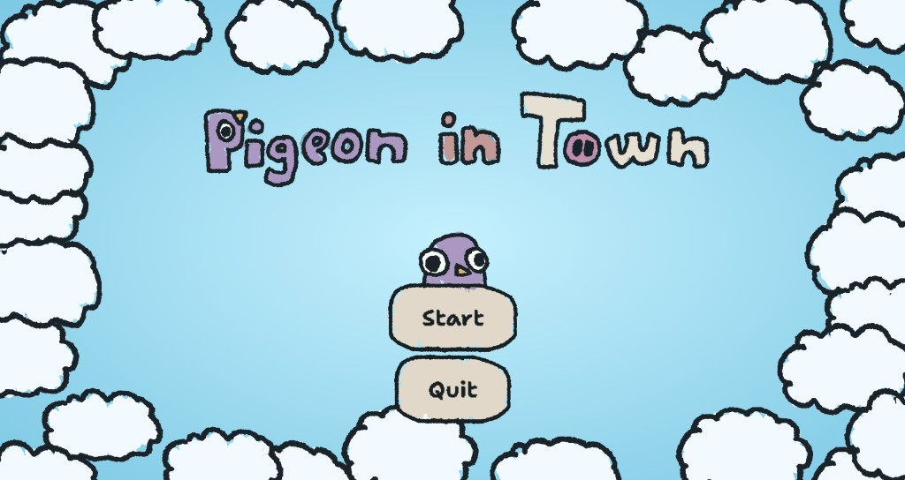
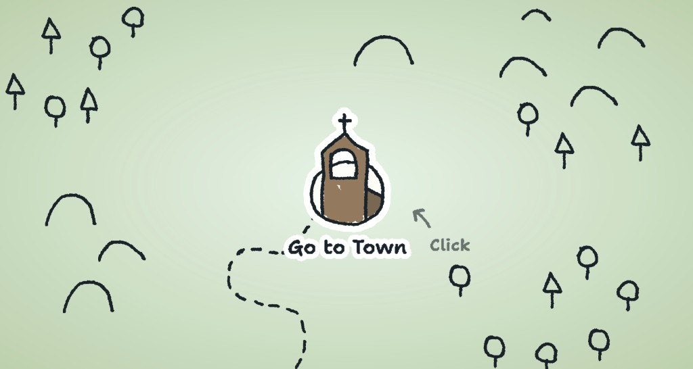
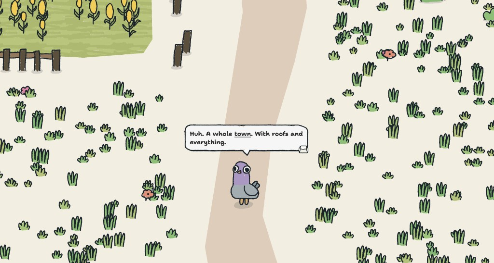
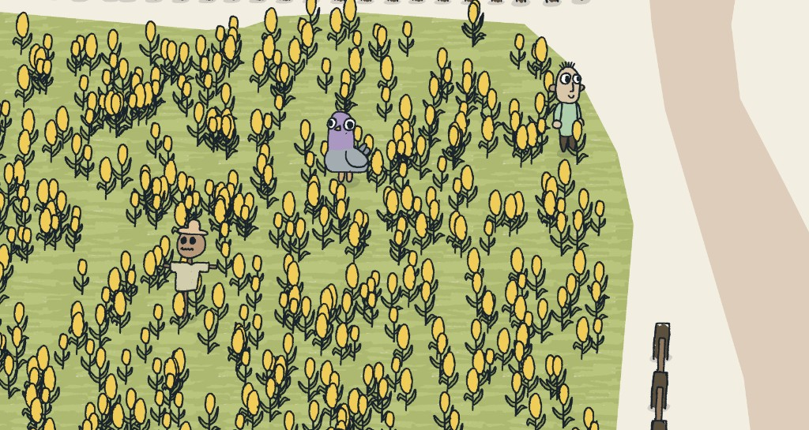
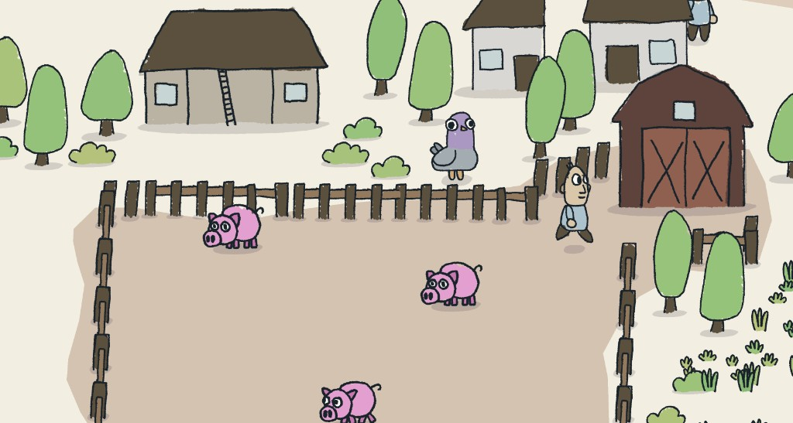
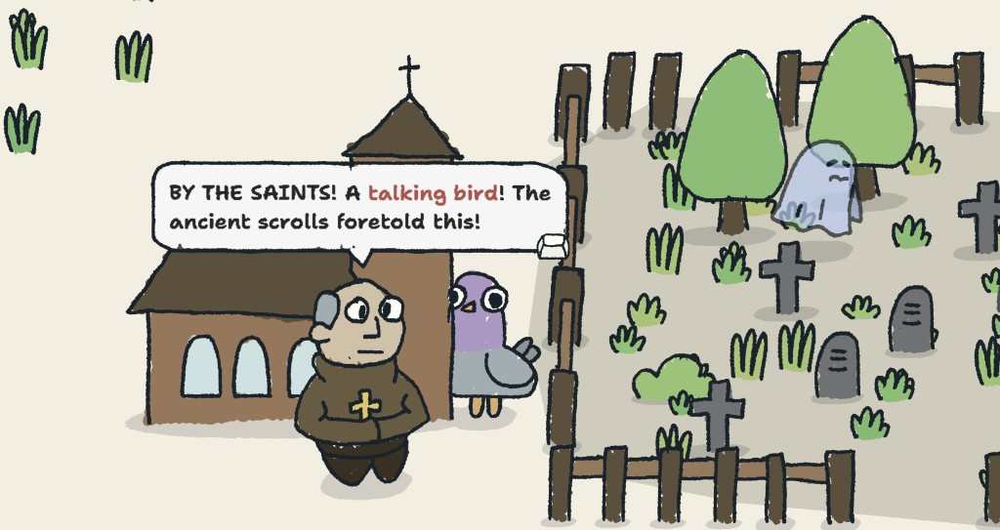
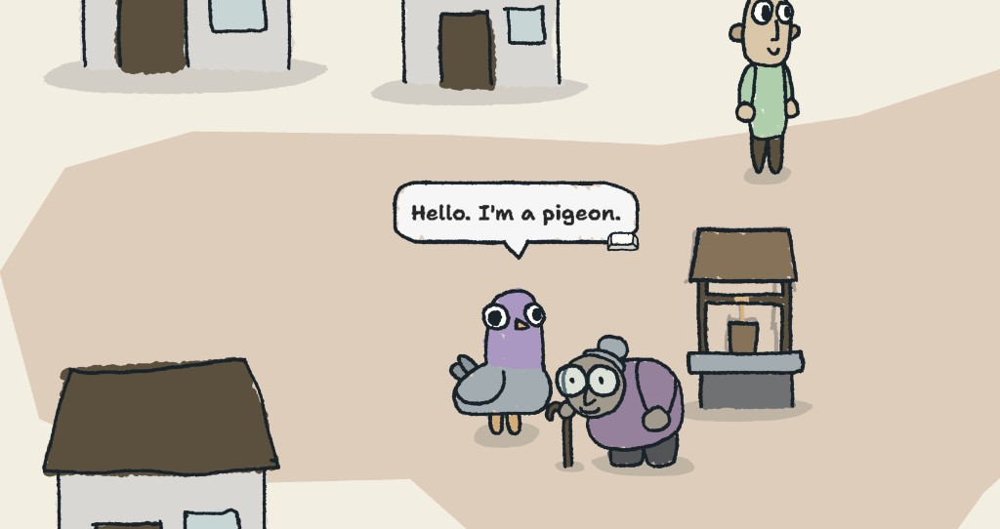

# Pigeon in Town

A small game made for Jerbob's silly game jam. Built with Godot 4.

You are a pigeon entering a new town. What interesting characters can you meet there?

## Controls

- Move around using **WSAD** or **arrow keys**
- Talk using **E**, **Enter**, or **Space**
- **ESC** to pause the game and check the achievements

## Goals

There are no real goals to achieve in this game. Just get to know the characters living in the town. Although there are a few achievements to gather if you want. You can see them in the pause menu. _Can you get them all?_

## Screenshots

